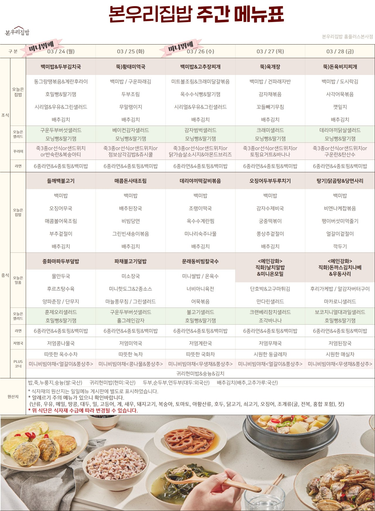
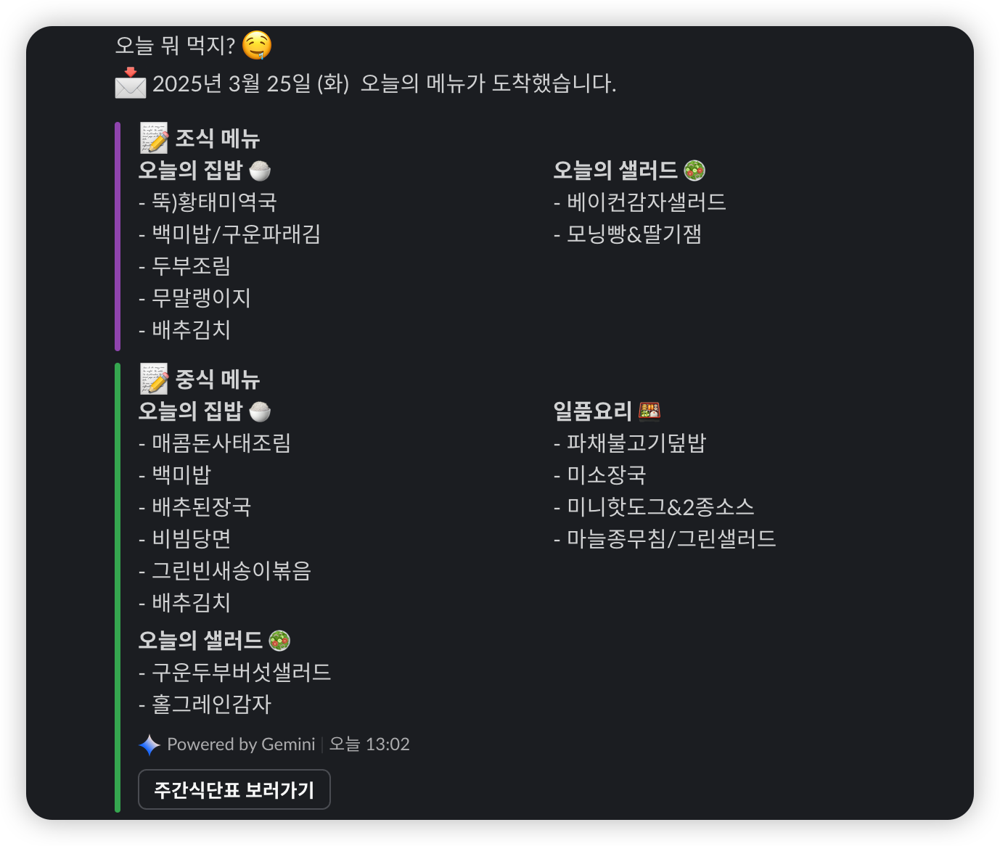

# 식단 OCR 알림봇

식단표 이미지를 OCR (자동 기록 인쇄) 데이터와 Gemini API를 연동하여, 오늘의 메뉴 정보를 파일이나 메시지로 전달해 줍니다.

## 기능

- **OCR 추출**: Tesseract, Kraken OCR 를 이용하여 식단표 이미지에서 텍스트 데이터 추출
- **AI 모델 연동**:
  - OpenAI API를 이용하여 추출한 텍스트 데이터를 가공하고, 두 가지 메뉴 중 더 영양가 좋은 선택지 제공
  - Google Gemini API를 통해 메뉴 정보를 구조화된 JSON 형식으로 변환
- **스케줄러스 시스템**: node-cron을 이용하여 주말을 제외한 오전 10시에 시스템 실행
- **연동 메시지 전달**: Slack, Telegram 등의 메시지 연동을 통해 사용자에게 공유
  - 두 가지 Slack 메시지 포맷 지원: 표준 형식(attachments)과 마크다운 형식(blocks)

## 사용된 OCR 라이브러리

### Kraken OCR

[Kraken](https://kraken.re/main/index.html)은 역사적 문서와 비라틴 스크립트 자료에 최적화된 OCR 시스템입니다.

주요 특징:

- 완전 훈련 가능한 레이아웃 분석, 읽기 순서 및 문자 인식
- 오른쪽에서 왼쪽(RTL), 양방향(BiDi) 및 위에서 아래(TTB) 스크립트 지원
- ALTO, PageXML, abbyyXML 및 hOCR 출력 형식 지원
- 단어 경계 상자 및 문자 분할
- 다중 스크립트 인식 지원
- 공개 모델 파일 저장소

이 프로젝트에서는 Kraken의 OCR 기능을 활용하여 식단표 이미지에서 텍스트를 추출합니다.

### Tesseract

Google에서 개발한 오픈 소스 OCR 엔진으로, 다양한 언어와 폰트를 지원합니다.

## 사용 방법

### 1. 설치

```sh
pnpm install
```

### 2. 환경설정 (.env 파일 설정)

.env 파일에 다음 값을 설정합니다.

```ini
PORT=3890
IMAGE_API_URL=https://api-url.example.com
OPENAI_API_KEY=your_openai_api_key
GEMINI_API_KEY=your_gemini_api_key
OCR_SPACE_API_KEY=your_ocr_space_api_key
SLACK_WEBHOOK_URL=your_slack_webhook_url
DISCORD_WEBHOOK_URL=your_discord_webhook_url
KRAKEN_API_KEY=your_kraken_api_key
KRAKEN_API_SECRET=your_kraken_api_secret
SERVER_KILL_KEY=your_server_kill_key
```

### 3. 시작

```sh
pnpm start
```

## Docker를 통한 실행

### Docker Compose 실행

1. 프로젝트 루트 디렉토리에 있는 `docker-compose.yml` 파일을 사용하여 서비스를 시작합니다:

```sh
docker-compose up -d
```

이 명령어는 다음 과정을 수행합니다:

- TypeScript 코드 빌드
- 서버 시작
- 자동으로 cron 작업 시작

2. 로그 확인:

```sh
docker-compose logs -f
```

3. 서비스 중지:

```sh
docker-compose down
```

### 환경 설정

도커 컴포즈 실행 시 다음 환경 변수가 사용됩니다:

- `PORT=3890`: 서버가 컨테이너 내부에서 실행되는 포트
- `NODE_ENV=production`: 프로덕션 모드로 실행

외부에서는 포트 3000으로 서비스에 접근할 수 있습니다 (포트 매핑: 3000:3890).

### 로그 저장

로그 파일은 호스트의 `./logs` 디렉토리에 마운트됩니다.

## 개발 환경

- **Backend**: Node.js, Express, TypeScript
- **OCR**: Tesseract, Kraken, ocr-space-api-wrapper
- **Scheduler**: node-cron
- **AI API**: OpenAI, Google Gemini

### Gemini API 통합

- Google의 Gemini API를 사용하여 메뉴 텍스트 분석 기능 추가
- 메뉴 데이터를 구조화된 JSON 형식으로 변환하여 더 정확한 메뉴 정보 제공

## 이미지 처리 및 알림 전송



식단표 이미지를 OCR과 LLM을 통해 처리하여

결과를 Slack에 알림으로 전송합니다.

이 기능은 사용자가 매일의 식단 정보를 쉽게 확인할 수 있도록 제공합니다.

## 관련 링크

- [Kraken OCR](https://kraken.re/main/index.html) - 역사적 문서와 비라틴 스크립트 자료에 최적화된 OCR 시스템
- [Tesseract OCR](https://github.com/tesseract-ocr/tesseract) - Google의 오픈 소스 OCR 엔진

## 라이센스

이 프로젝트는 [MIT License](https://opensource.org/licenses/MIT) 을(를) 적용합니다.
